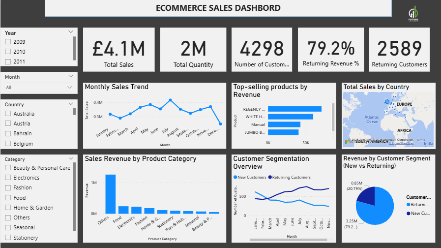

# Task 1: E-Commerce Sales Dashboard (2009–2011)

This project analyzes UK-based e-commerce sales data from 2009–2011 to uncover **best-selling products, sales trends, and high-revenue categories**.  
The goal is to help business owners and decision-makers **understand performance drivers** and make data-driven decisions.

## Ecommerce Sales Dashboard


---

## Overall Summary

The business generated **£4.1M in revenue** and sold **2 million units** during the period, with **returning customers contributing 79.2% of total revenue** — indicating strong customer loyalty.  
Sales peaked mid-year and are concentrated in a few high-performing products and categories.

---

## Key Insights & Recommendations

### 1. Monthly Sales Trend
- **Insight:** Sales followed a gradual upward trend from February to July, peaking in July.  
  A noticeable drop occurs in December, suggesting **seasonality or end-of-year slowdown**.
- **Recommendation:** Investigate what drives mid-year performance (promotions or seasonal demand).

### 2. Top-Selling Products by Revenue
- **Insight:** A few products (like *"Regency Cakestand 3 Tier"* and *"White Hanging Heart T-Light Holder"*) dominate revenue.  
  Revenue beyond the top 5 drops off sharply, showing **heavy reliance on a small product set**.
- **Recommendation:** Diversify product promotion and boost mid-tier items to reduce risk.

### 3. Total Sales by Country
- **Insight:** **Europe is the dominant region** for sales, with pockets in Africa.  
  **Asia shows low or no activity**, as visualized on the map.
- **Recommendation:** Expand marketing or distribution strategies in **underperforming regions**.

### 4. Sales Revenue by Product Category
- **Insight:** The "**Others**" category is by far the largest contributor, likely due to **poor product categorization**.  
  Fashion, Food, and Electronics follow at a much lower scale.
- **Recommendation:** Refine product categorization for more actionable insights and boost weaker categories.

### 5. Customer Segmentation (Monthly Trends)
- **Insight:** **Returning customers consistently outnumber new customers**, especially from March onward.  
  New customer acquisition is **low and relatively flat**.
- **Recommendation:** Focus on **lead generation and conversion strategies** to grow the customer base.

### 6. Revenue by Customer Segment
- **Insight:** Returning customers contribute **£3.25M (79.2%)** of total revenue, while new customers generate **£0.85M (20.8%)**.  
  This indicates **strong retention and repeat purchasing behavior**.
- **Recommendation:** **Leverage loyalty** (e.g., through loyalty programs) but also **invest in new customer acquisition**.

---

## KPI Insights
- **Total Sales:** £4.1M  
- **Total Quantity Sold:** 2 million units  
- **Returning Customer Revenue:** 79.2% of total revenue  
- **Returning Customers:** 2,589 out of 4,298 total customers  

---

## Final Recommendations
1. Boost **new customer acquisition** while maintaining loyalty.  
2. Balance **revenue reliance** by promoting products beyond the top 5.  
3. Explore **regional growth** opportunities outside Europe.  
4. Personalize campaigns for **returning customers** to drive repeat sales.  
5. Refine **product categorization**, as “Others” is too dominant.

---

## Tools & Skills Used
- **Power BI Desktop** – for building the interactive dashboard  
- **Excel** – for data cleaning and preparation  
- **DAX (Data Analysis Expressions)** – for KPIs and customer segmentation  
- **Data Modeling** – created relationships, date table, and hierarchies  
- **Business Storytelling** – visualizing insights for decision-making  

---

## What I Learned
- Cleaning and transforming raw e-commerce sales data  
- Building time-based hierarchies (Year, Month) for trend analysis  
- Writing DAX measures for KPIs like New vs Returning Customers  
- Designing interactive dashboards with slicers and drill-through  
- Presenting insights clearly for non-technical stakeholders  

---

## Repository Contents
### 📁 Files in this Project

* 📄 [README.md](README.md)
* 📊 [Task1_dashboard.png](Task1_dashboard.png)
* 📗 [All_Sales_Data (3).xlsx](All_Sales_Data%20(3).xlsx)
* 📝 [ProductCategory_MappingTable.csv](ProductCategory_MappingTable.csv)
* 📓 [college_event_feedback_analysis(Task_3).ipynb](college_event_feedback_analysis(Task_3).ipynb)

---

## How to View the Dashboard
1. Clone or download this repository:
   ```bash
   git clone https://github.com/MithinYadav/FUTURE_DS_01/blob/main/README.md

2. Open Task1_Dashboard.pbix in Power BI Desktop (free to download [here](https://powerbi.microsoft.com/desktop/)).

3. Use the filters and visuals to explore sales trends, best-selling products, and customer insights.
